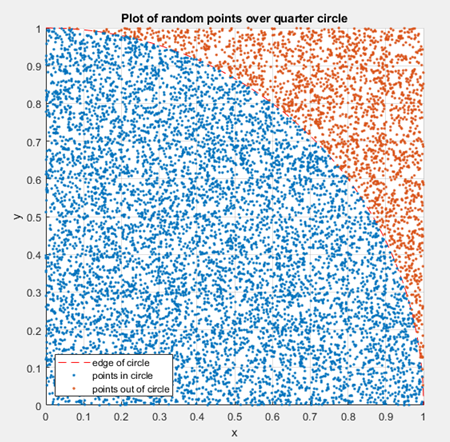

# Cálculo de Pi pelo Método de Monte Carlo
**Projeto de Sistemas Distribuídos**

## Descrição

Este projeto tem como objetivo estimar o valor de π (Pi) utilizando o **Método de Monte Carlo**, uma técnica probabilística baseada em geração de números aleatórios. Foram desenvolvidas três versões da solução:

- **Sequencial** – executa em uma única thread.
- **Paralela** – executa em múltiplas threads em uma única máquina.
- **Distribuída** – executa em múltiplas máquinas utilizando comunicação via sockets.

O projeto foi desenvolvido como trabalho prático para a disciplina de **Sistemas Distribuídos (2025/01)**.

## Como Funciona o Algoritmo

A lógica se baseia em simular pontos aleatórios dentro de um quadrado que contém um quarto de círculo. A proporção de pontos que caem dentro do círculo, comparada ao total de pontos gerados, permite estimar o valor de Pi pela seguinte fórmula:

π ≈ 4 × (número de pontos dentro do círculo / número total de pontos)

Quanto maior o número de pontos, mais precisa será a estimativa, conforme a **Lei dos Grandes Números**.



## Estrutura do Projeto

```
ProjetoFinalSD/
├── sequencial/          # Implementação sequencial
│   └── codigo_sequencial.py
├── paralela/            # Implementação paralela com threading
│   └── codigo_paralelo.py
├── distribuida/         # Implementação distribuída com sockets
│   ├── servidor.py
│   ├── thread_servidor.py
│   └── cliente.py
├── README.md            # Este arquivo
└── relatorio/           # Relatório do projeto (PDF)
```

## Como Executar

### Pré-requisitos

- Python 3.10 ou superior
- Bibliotecas padrão (`threading`, `socket`, `random`)

### Execução

#### Sequencial

```bash
cd sequencial
python codigo_sequencial.py.py
```

#### Paralela

```bash
cd paralela
python codigo_paralelo.py
```

#### Distribuída

No servidor:

```bash
cd distribuida
python servidor.py
```

Em cada cliente (pode ser em outras máquinas na mesma rede):

```bash
cd distribuida
python cliente.py
```

## Análise de Desempenho

| Nº de Pontos | Sequencial | Paralela | Distribuída |
|---------------|------------|----------|--------------|
| 1.000.000     | 3,1421880  | 3,1411920| 3,1419240    |
| 5.000.000     | 3,1407592  | 3,1417912| 3,1418696    |
| 10.000.000    | 3,1427664  | 3,1423972| 3,1413876    |

## Apresentação em Vídeo

Para uma demonstração do projeto e a explicação do seu funcionamento, assista à nossa apresentação em vídeo.

**[Assistir à apresentação no Google Drive](https://drive.google.com/drive/folders/1kveuLLAwwzj_b4YPcV9vGgfxCBfTvntj)**

## Ambiente de Teste

- Notebook Acer Nitro 5  
- CPU: Intel Core i5-9300H (4 núcleos)  
- RAM: 16GB  
- GPU: NVIDIA GTX 1650 (4GB)  
- Sistema Operacional: Windows 10 64 bits  

## Tecnologias e Ferramentas

- Python (threading, socket, random)
- Suporte pontual do Gemini (Google AI) para refatoração e debug

## Desafios e Soluções

- **Sequencial**: Desempenho limitado → Solução: desenvolvimento das versões paralela e distribuída.
- **Paralela**: Condições de corrida → Solução: uso de `threading.Lock`.
- **Distribuída**: Orquestração e comunicação entre clientes e servidor → Solução: gerenciamento de conexões com múltiplas threads no servidor.

## Integrantes do Grupo

- Álison Christian R. V. de Carvalho  
- Andrei Rezende Ono  
- Antônio Marcos Fontes Darienco  
- George Silva De Oliveira  
- João Pedro Correia Leite Moreira  
- Pablo Alonso Latapiat de Freitas  
- Rodolfo Ferreira Sapateiro
